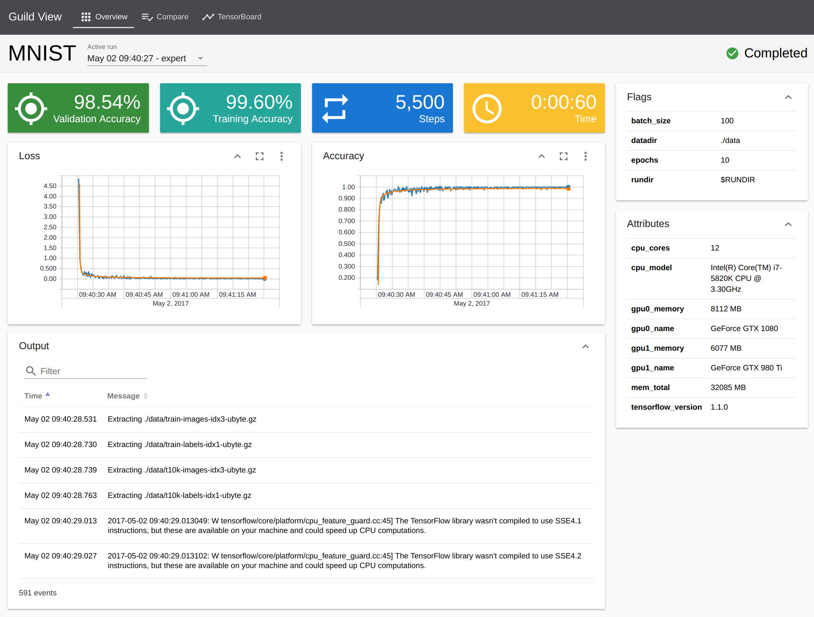
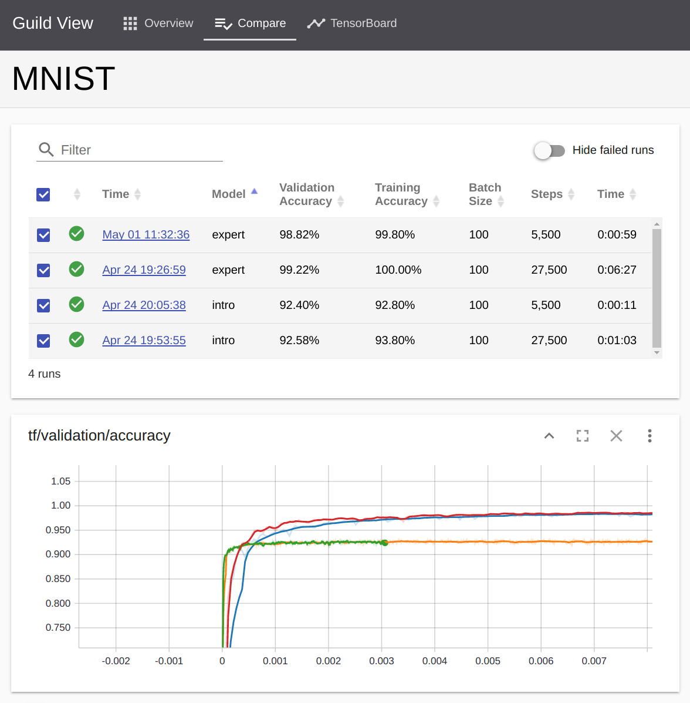
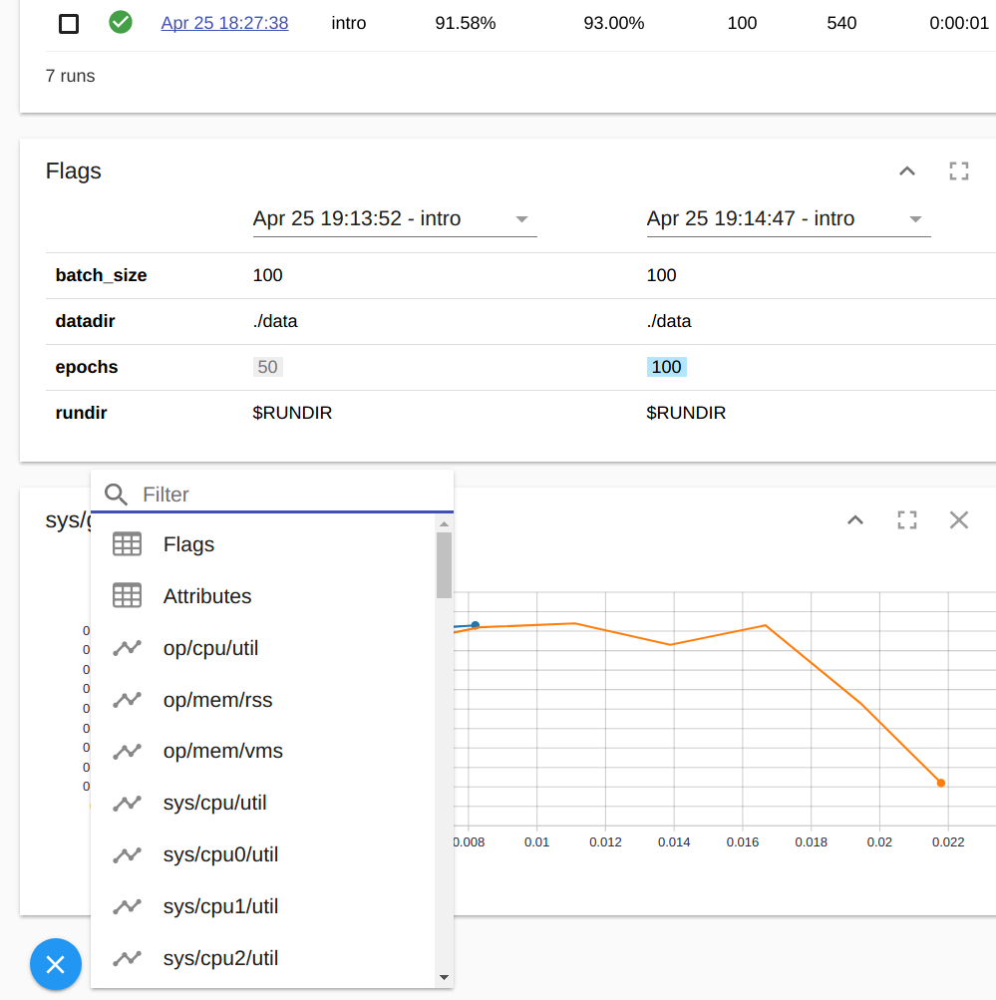
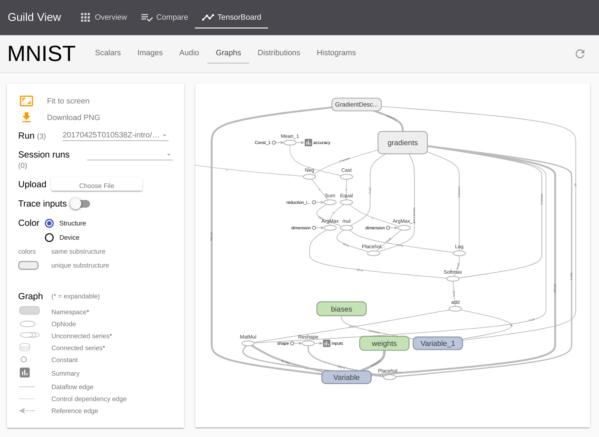

<h2 style="font-size:200%">TensorFlow visualization with Guild AI</h2>

TensorBeat, Sunnyvale May 7, 2017

[Garrett Smith](http://gar1t.com) / [@gar1t](https://twitter.com/gar1t)

---

<section data-background="#336">
<h2>Topics</h2>

<ul>
<li class="fragment">Quick demo
<li class="fragment">Project motivation
<li class="fragment">Deeper dive
<li class="fragment">Road map
<li class="fragment">Getting involved
</ul>

</section>

---

<section data-background="#336">
<h2>Quick demo</h2>
</section>

---

---

<section data-background="#336">
<h2>Project motivation</h2>
</section>

---

<ul>
<li>Streamline TensorFlow operations
<li class="fragment">Simplify model development, especially for new users
<li class="fragment">Encourage model reuse and collaboration
</ul>

---

## Streamline TensorFlow operations

<pre class="fragment narrow">
$ prepare
</pre>

<pre class="fragment narrow mt">
$ train [MODEL] [--profile PROFILE]
</pre>

<pre class="fragment narrow mt">
$ evaluate --latest-run
</pre>

---

<pre class="narrow">
$ guild view
</pre>

---

<pre class="narrow">
$ guild view
</pre>

---

<pre class="narrow">
$ guild view
</pre>

---

<pre class="narrow">
$ guild view
</pre>

---

<pre class="narrow">
$ guild serve ./runs/20170430T190348Z-expert
</pre>

<pre class="narrow fragment mt mb0">
$ curl http://localhost:6444/run -d @request.json
</pre>

<pre class="narrow fragment mt0" style="font-size:18px">
[
  {
    "prediction": [
      -7.542473793029785,
      -10.782925605773926,
      -8.505668640136719,
      8.639995574951172,
      -7.128697872161865,
      17.12053108215332,
      -9.917960166931152,
      2.7283005714416504,
      -1.4990053176879883,
      8.320530891418457
    ]
  }
]
</pre>

---

## Simplify user experience

---

<ul>
<li>Highlight what&rsquo;s most important
<li class="fragment">Low level details (power features) follow
<li class="fragment">Lower barriers to model reuse (collaboration)
</ul>

---

<section data-background="#336">
<h2>Deeper dive</h2>
</section>

---

## Guild project file

<pre class="fragment mb0">
[project]

name            = MNIST
description     = Guild MNIST example
</pre>

<pre class="fragment mt0 mb0">
[model "intro"]

train           = intro
prepare         = intro --prepare
train_requires  = ./data
evaluate        = intro --test
</pre>

<pre class="fragment mt0">
[flags]

datadir         = ./data
rundir          = $RUNDIR
batch_size      = 100
epochs          = 10
</pre>

---

## Defining FLAGS

<pre>
parser = argparse.ArgumentParser()
parser.add_argument("--datadir",    default="/tmp/MNIST_data",)
parser.add_argument("--rundir",     default="/tmp/MNIST_train")
parser.add_argument("--batch_size", type=int, default=100)
parser.add_argument("--epochs",     type=int, default=10)
parser.add_argument("--prepare",    action="store_true", dest='just_data')
parser.add_argument("--test",       action="store_true")

FLAGS, _ = parser.parse_known_args()
</pre>

---

## Using FLAGS

<pre>
steps = (NUM_EXAMPLES // <b>FLAGS.batch_size</b>) * <b>FLAGS.epochs</b>
for step in range(steps + 1):
    images, labels = mnist.train.next_batch(<b>FLAGS.batch_size</b>)
    batch = {x: images, y_: labels}
    sess.run(train_op, batch)
</pre>

---

## RUNDIR

<ul>
<li class="fragment">Location for all run artifacts (training op)
<li class="fragment">Automatically created by Guild
<li class="fragment">Specified as command line option and env variable
<li class="fragment">Scripts must be modified to use this value
</ul>

---

## Using RUNDIR

<pre>
train      = tf.summary.FileWriter(<b>FLAGS.rundir</b> + "/train")
validation = tf.summary.FileWriter(<b>FLAGS.rundir</b> + "/validation")
</pre>

<pre class="fragment mt0">
tf.gfile.MakeDirs(<b>FLAGS.rundir</b> + "/model")
tf.train.Saver().save(sess, <b>FLAGS.rundir</b> + "/model/export")
</pre>

<pre class="fragment">
saver = tf.train.import_meta_graph(
            <b>FLAGS.rundir</b> + "/model/export.meta")
saver.restore(sess, <b>FLAGS.rundir</b> + "/model/export")
</pre>

---

## Run DB

<ul>
<li class="fragment">Indexed database for run series data
<li class="fragment">Makes Guild performance possible
<li class="fragment">Standard SQLite interface
</ul>

---

## Data collectors

<ul>
<li class="fragment">TensorFlow events
<li class="fragment">System stats (psutil and custom)
<li class="fragment">GPU stats (nvidia-smi)
</ul>

---

## Polymer web components

    

---

## TensorBoard integration

<ul>
<li class="fragment">Run TensorBoard as a background process
<li class="fragment">Proxy requests for TensorBoard data
<li class="fragment">Bundle TensorBoard Polymer components
</ul>

---

<section data-background="#336">
<h2>Road map</h2>
</section>

---

<ul>
<li>Enhanced visualization
<li class="fragment">Smart analysis and comparison
<li class="fragment">Plugin exchange with TensorBoard project
<li class="fragment">More examples (model zoo)
<li class="fragment">Guild enabled projects
</ul>

---

<section data-background="#336">
<h2>Getting involved</h2>
</section>

---

<ul>
<li>https://github.com/guildai/guild
<li class="fragment">Apache 2.0 license
<li class="fragment">Polymer web components
<li class="fragment">Python interface to TensorFlow
<li class="fragment">Shell and Python interface to OS
</ul>

---

## Questions

---

<table>
<tr><th>Email   </th><td>g@rre.tt</td></tr>
<tr><th>GitHub  </th><td>gar1t</td></tr>
<tr><th>Twitter </th><td>@gar1t</td></tr>
</table>

<!--

export PS1="\[\033[01;32m\]MNIST\[\033[00m\] $ "

-->
